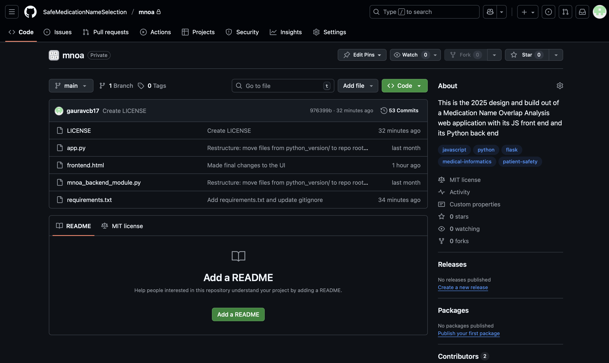
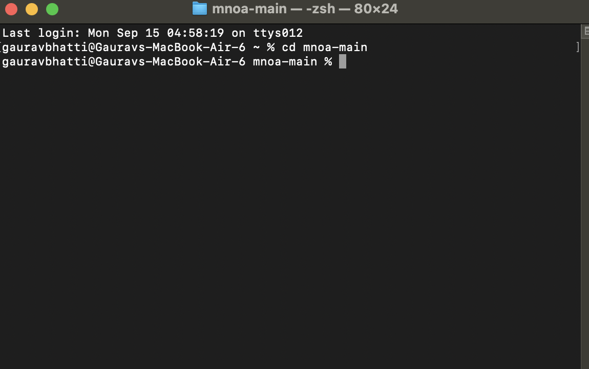
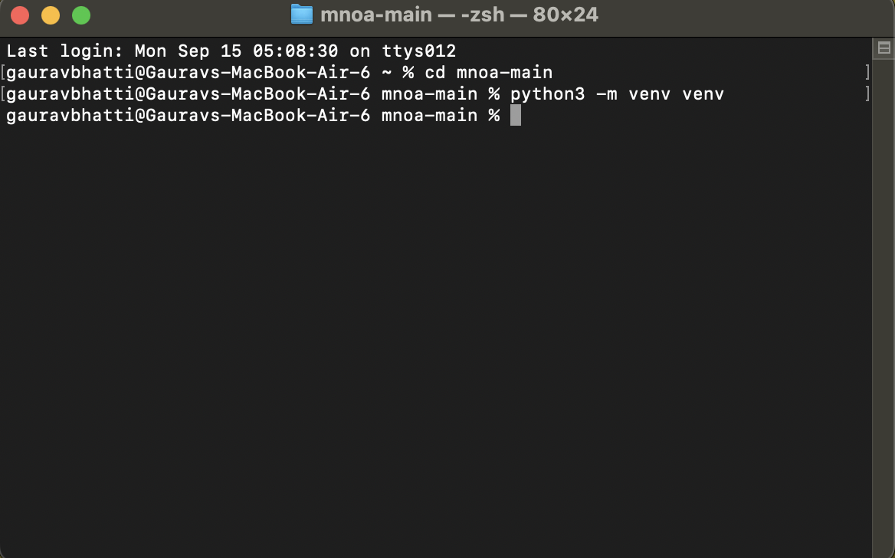
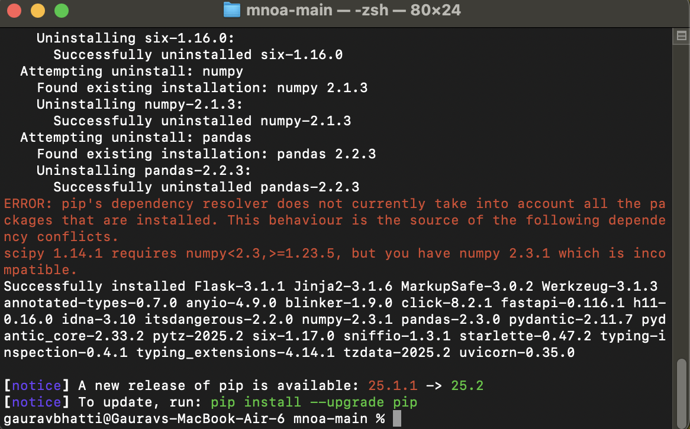
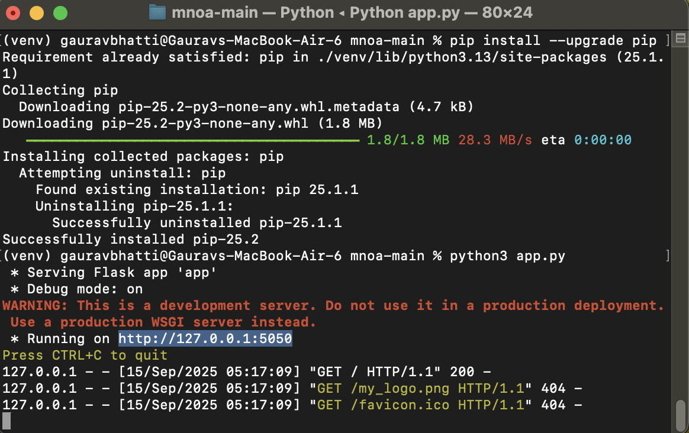
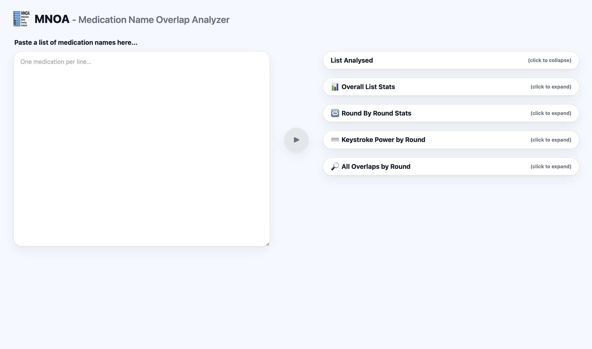

# MNOA: A Medication Name Overlap Analyzer

This repository contains the source code for the Medication Name Overlap Analyzer (MNOA), a web-based research tool developed in Python and Flask. The application is designed to analyze lists of medication names to identify potential "look-alike" conflicts that can contribute to medication selection errors, a significant challenge in patient safety.

This work represents a 2025 reimplementation and modernization of the foundational concepts presented in the "Keystroke Disambiguation" project. The core analytical engine has been changed to a server-side Python implementation to support a robust, interactive web interface.

---

### Application Interface

---

### Background & Rationale

The accurate identification and selection of medications are critical for patient safety. With thousands of pharmaceutical products on the market, the potential for name confusion is a persistent risk. Such confusion can arise from names that are orthographically similar (look-alikes) or phonetically similar (sound-alikes), leading to medication errors that may result in patient harm.

This project addresses this challenge through the lens of **keystroke disambiguation**: the process of determining the minimum number of characters required to uniquely identify a medication name from a given list during a search task. For instance, the names "Fluconazole" and "Fluoxetine" are indistinguishable after the first three keystrokes ("Flu"). Only upon entry of the fourth character do the search terms diverge ("Fluc" vs. "Fluo"). This tool is designed to systematically quantify these points of ambiguity across a given formulary or list of names.

---

### System Architecture & Methodology

The application operates on a client-server model:

1.  **Frontend Interface:** A static HTML and JavaScript frontend (`frontend.html`) provides the user interface for data input and results visualization.
2.  **Backend Server:** A Flask web server (`app.py`) exposes a single API endpoint (`/disambiguate`) to receive and process analysis requests.
3.  **Analysis Engine:** The core analytical logic resides in the `mnoa_backend_module.py`. Upon receiving a list of medication names, this module performs cleaning, sorting, and an iterative prefix analysis to calculate disambiguation metrics, including "Keystroke Power" (KP).
4.  **Data Exchange:** The frontend transmits the raw list of names as a JSON payload to the backend. The backend returns a structured JSON object containing the complete analysis, which the frontend then parses and renders dynamically.

---

### Local Deployment for Research & Verification

To deploy and run this application locally, a Python 3.8+ environment is required. The following steps provide a comprehensive guide to setup.

**Step 1: Download the Repository**
* Navigate to the main GitHub repository page. Click the green **`< > Code`** button and select **Download ZIP**.
* Extract the contents of the downloaded ZIP file to a suitable location on your local machine.

**Step 2: Open a Terminal and Navigate to the Project Directory**
* Open a command-line terminal (e.g., Terminal on macOS, PowerShell on Windows).
* Use the `cd` (change directory) command to navigate into the unzipped project folder (e.g., `cd Downloads/mnoa-main`).

**Step 3: Create and Activate a Python Virtual Environment**
* A virtual environment isolates the project's dependencies. Execute the command `python3 -m venv venv` to create it.
* Activate the environment using the appropriate command for your operating system. After activation, your terminal prompt will be prefixed with `(venv)`.

**Step 4: Install Required Dependencies**
* Execute the command `pip install -r requirements.txt`. This will install the Flask library required to run the web server.

**Step 5: Launch the Application Server**
* Execute the command `python3 app.py` to start the Flask development server.
* The terminal will indicate that the server is running and listening for requests.

**Step 6: Access the Application**
* Open a web browser and navigate to the local address `http://127.0.0.1:5000`.
* The MNOA web interface will now be accessible for use.

---

### 📚 Citation

*(Please insert the appropriate academic citation for the original research here, as provided by your PI.)*