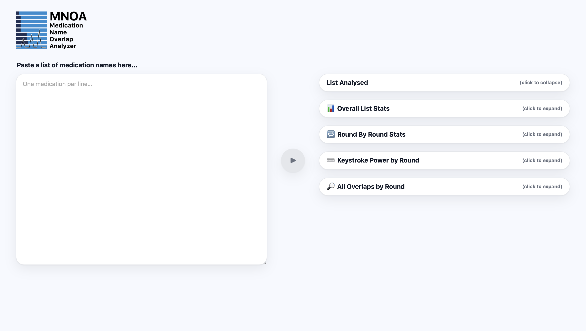
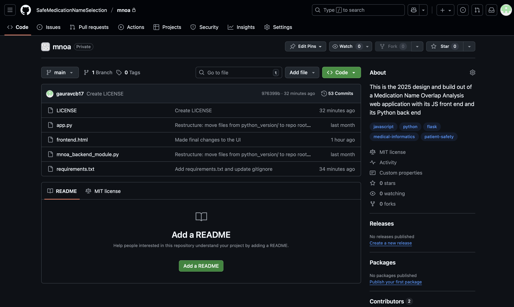
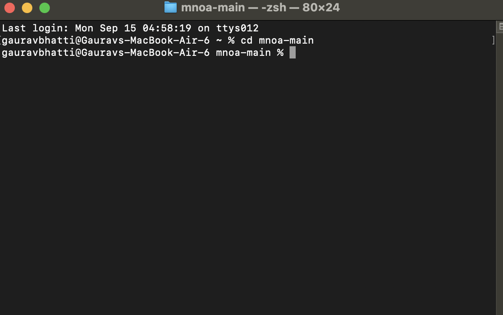
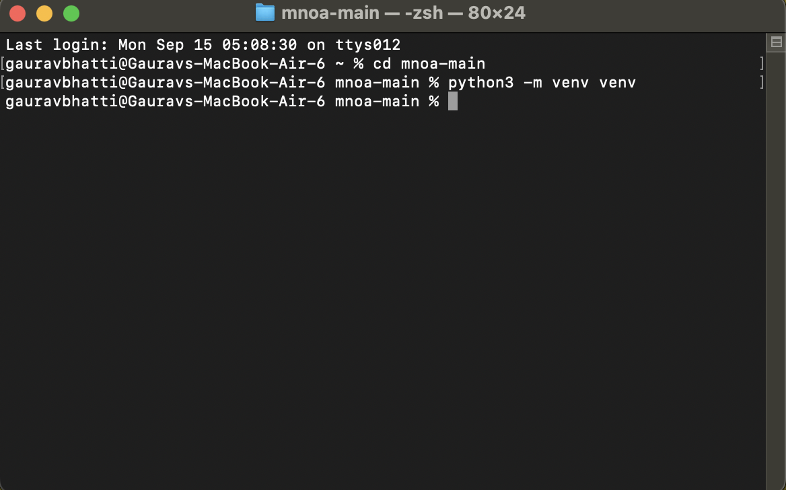
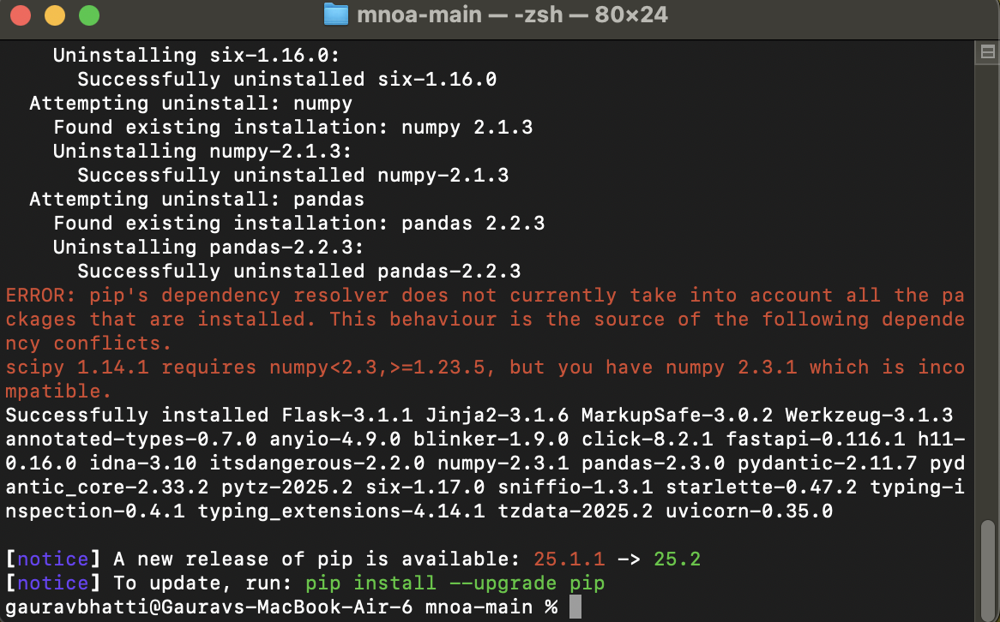
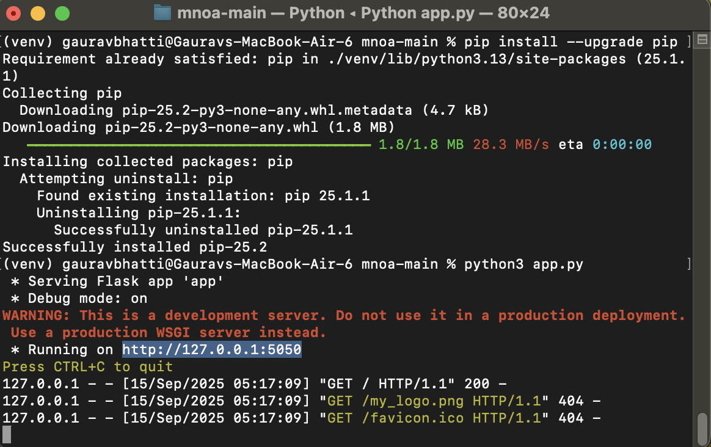
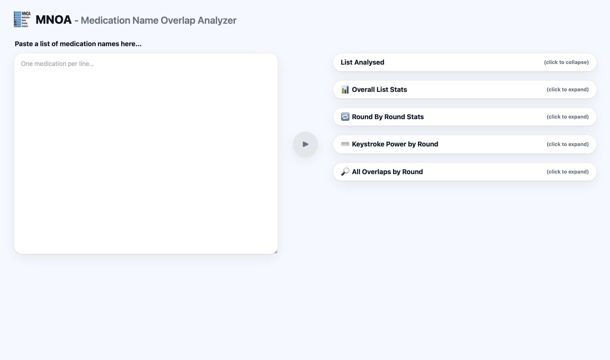

# MNOA: A Medication Name Overlap Analyzer

- Developed by: Gaurav Bhatti (2025)
- Designed by: Gaurav Bhatti and Allen Flynn (2025)
- Invented by: Allen Flynn, Conor Myers, and Katie Mieure (2023)

---

This repository contains the source code for an implementation of a Medication Name Overlap Analyzer (MNOA). This MNOA tool is web-based and has been developed in Python using Flask. A similar tool has been used in research. A published paper with results showing how the characters in medication names overlap from left to right is available at this [link](https://academic.oup.com/ajhp/article-abstract/81/14/622/7613639). 

The MNOA tool is designed to analyze lists of medication names for left-to-right character overlap. This overlap can cause confusion and contribute to medication selection errors, a concerning patient safety challenge. 

This work represents a reimplementation of the original software from in the "Keystroke Disambiguation" project. Here, the core medication name overlap analysis engine has been implemented inside a server-side Python file to support a easy-to-use interactive web interface. More information about the "Keystroke Disambiguation" project can be found [here](https://github.com/SafeMedicationNameSelection/Keystroke_Disambiguation).

---

### Application Interface

---

### Background & Rationale

The accurate identification and selection of medications is critical for patient safety. With thousands of drug products on the market, the potential for name confusion is a persistent risk. Such confusion can arise from names that are similar, orthographically (look-alikes) or otherwise. Medication errors where the name of one medication is confused with that of another have resulted in patient harm.

This project addresses how to use software to prevent users from confusing one medication name for another. It approaches preventing medication name confusion through the lens of **keystroke disambiguation** which is the process of determining the minimum number of characters required to uniquely identify a medication name from a given list during a search task. For instance, the names "fluconazole" and "fluoxetine" only become distinguishable after the first three characters ("flu) or, when searching and matching by name, only the after first three keystrokes. Only upon entry of a fourth character do the search terms diverge ("fluc" vs. "fluo"). The MNOA tool systematically quantifies the number or characters needed to remove ambiguity from every medication name on a given list of names.

---

### System Architecture

This MNOA tool operates on a client-server model:

1.  **Frontend Interface:** A static HTML and JavaScript frontend (`frontend.html`) provides the user interface for data input and results visualization.
2.  **Backend Server:** A Flask web server (`app.py`) exposes a single API endpoint (`/disambiguate`) to receive and process requests to analyze lists of medication names.
3.  **Analysis Engine:** The core analytical logic resides in the `mnoa_backend_module.py`. Upon receiving a list of medication names, this module performs cleaning, sorting, and an iterative name prefix analysis to calculate disambiguation metrics, including "Keystroke Power" (KP). More information about the KP metric can be found in the research paper linked above.
4.  **Data Input and Output:** The frontend allows a user to paste a list of medication names and transmits that raw list as a JSON payload to the backend. The backend returns a structured JSON object containing the complete medication name overlap analysis, which the frontend then parses and renders dynamically.

---

### Local Deployment

To deploy and run this application locally, a Python 3.8+ environment is required. The following steps provide a guide to setup.

**Step 1: Download this Github Repository**
* Navigate to the main GitHub repository page. Click the green **`< > Code`** button and select **Download ZIP**.
* Extract the contents of the downloaded ZIP file to a suitable location on your local machine.

**Step 2: Open a Terminal and Navigate to the Project Directory**
* Open a command-line terminal (e.g., Terminal on macOS, PowerShell on Windows).
* Use the `cd` (change directory) command to navigate into the unzipped project folder (e.g., `cd Downloads/mnoa-main`).

**Step 3: Create and Activate a Python Virtual Environment**
* A virtual environment isolates the project's dependencies. Execute the command `python3 -m venv venv` to create it.
* Activate the environment using the appropriate command for your operating system. After activation, your terminal prompt will be prefixed with `(venv)`.

**Step 4: Install Required Dependencies**
* Execute the command `pip install -r requirements.txt`. This will install the Flask library required to run the web server.

**Step 5: Launch the Application Server**
* Execute the command `python3 app.py` to start the Flask development server.
* The terminal will indicate that the server is running and listening for requests.

**Step 6: Access the Application**
* Open a web browser and navigate to the local address `http://127.0.0.1:5000`.
* The MNOA web interface will now be accessible for use.

---
