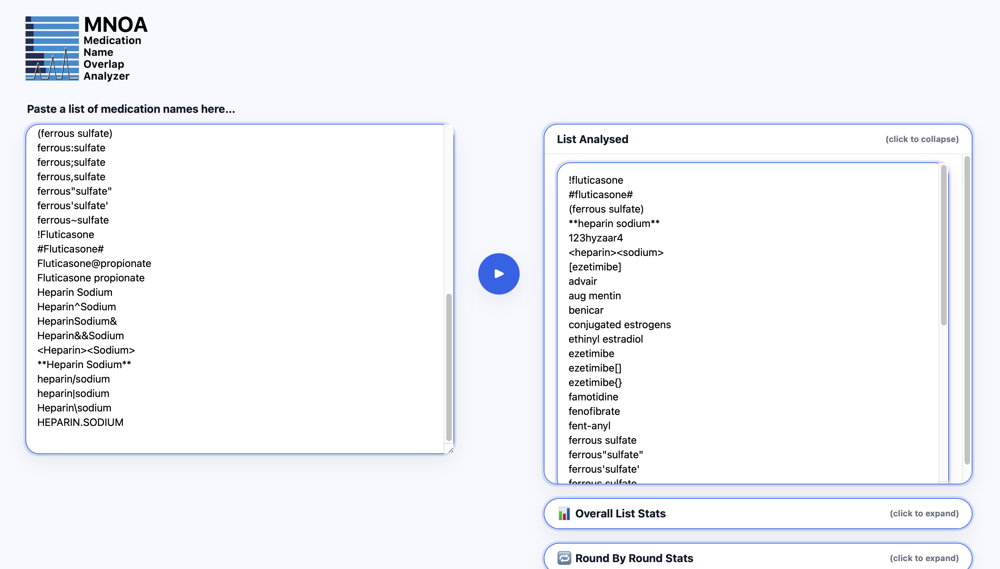
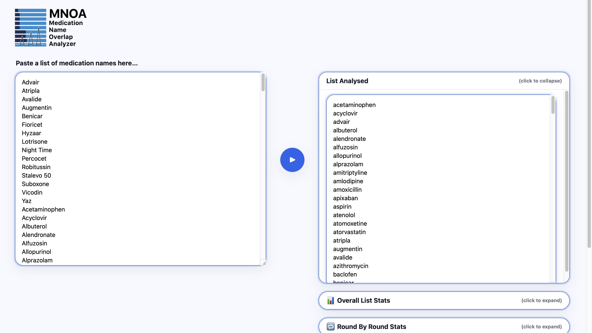

# MNOA Backend Test Guide

This folder contains two standardized Excel datasets for testing and validating the MNOA backend algorithm. This guide explains how to use them and what the results signify.

---

## How to Run a Test

To use these test files, follow these steps:

1.  Ensure the MNOA application is running and accessible in your web browser.
2.  Open either `Test 1.xlsx` or `Test 2.xlsx` on your computer.
3.  Select and copy the entire column of medication names from the spreadsheet.
4.  Paste the copied list into the input text area on the MNOA web interface.
5.  Click the "Analyze" button (▶) to process the list and view the results.

---

## Test Case 1: Data Cleaning Validation

### Purpose
This test uses `Test 1.xlsx` to validate the robustness of the algorithm's **`clean_names` function** against messy, real-world data.

### Input
The input file `Test 1.xlsx` contains 44 raw medication names with a variety of intentional formatting issues.

### Results & Analysis
The algorithm correctly processes the 44 raw entries and produces a clean, unique, and alphabetized list of 20 names. This demonstrates that the cleaning logic successfully handles:
- **Case variations:** `ADVAIR` and `FaMOTidine` are correctly converted to lowercase.
- **Symbols and Numbers:** `Fioricet()` and `123hyzaar4` are stripped of non-alphabetic characters.
- **Invalid Entries:** Names containing `?` are correctly ignored and excluded from the final list.
- **Duplicates:** All variations of a name (e.g., `LIPITOR`, `Lipitor-10mg`) are consolidated into a single entry.

The final output should match the screenshot below, confirming the data cleaning function is working as expected.

---

## Test Case 2: Disambiguation Performance

### Purpose
This test uses `Test 2.xlsx` to validate the performance and correctness of the **`disambiguation` algorithm** on a large, clean dataset representative of a real-world formulary.

### Input
The input file `Test 2.xlsx` contains 227 unique, pre-cleaned medication names.

### Results & Analysis
The algorithm analyzes all 227 names and provides detailed disambiguation metrics. Key observations from the results include:
- **Comprehensive Analysis:** All 227 names are correctly processed and analyzed.
- **Most Powerful Keystroke:** The output shows a value of **15**. This is a critical metric, indicating that the most difficult step in the analysis required the algorithm to resolve 15 simultaneous name conflicts in a single round. This demonstrates the algorithm's ability to handle significant prefix overlaps.
- **Performance Metrics:** The "Round By Round Stats" and "Keystroke Power by Round" tables provide a detailed breakdown of the algorithm's efficiency at each character length, showing how ambiguity is resolved over time.

The final output should match the screenshot below, confirming the disambiguation engine is performing correctly on a large scale.

